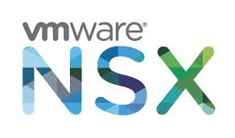

 

# NSX-T - Distributed IDS/IPS Proof of Value Guide

  

---
## NOTE - THIS IS IMPORTANT TO READ AND FOLLOW ALONG
This is a modified fork of the original project.  The aim here is fixes and to containerize the PoV.  This will be folded into the main project
after validation if it makes sense.  Instructions specific to this version are housed in this NOTE section.  To install follow these instructions:

* Install [Docker](https://www.docker.com/get-started) on your system if it isn't already.
* Pull updated PowerCLI base container:
  * `docker pull djmeier/powerclicore-nsx:latest`
* Pull project files from temporary GitHub repo:
  * `https://github.com/davidjmeier/nsx-eval-ids-ips-wip`
* Rename `Nested Lab Deployment.template` to `Nested Lab Deployment.ps1`.
* Modify `Nested Lab Deployment.ps1`.
  * Enter credential and license information where appropriate.
  * Modify `x.x.x.#` IP addresses.  All other addressing can be left as it's likely part of overlay.
  * MAKE SURE YOU CREATE THE PORTGROUP defined at `$NSXVTEPNetwork`.  You can change the name, but this needs to be created before the script is launched!
* Make sure all software required and referenced within the `Nested Lab Deployment.ps1` file is placed in the `lab-software` directory.
  * NOTE: The VCSA ISO should be extracted within the `lab-software` directory.  It is not referenced as an ISO in the deployment software.
  * NOTE: Software versions are the latest where possible.  If you don't have the latest bits you'll need to change the file names.
* Run the deploy script:
  * `bash ./deploy_lab_docker.sh`
* Sit back and relax.  This should take anywhere between 45 and 110 minutes depending on your link speed from the source computer to the vCenter host.

### PLEASE READ THIS AFTER YOU'VE DEPLOYED
All original documentation starts below this line and may not pertain to the above portion...  Thanks for playing!

---
## Overview
The goal of this Proof of Value (PoV) is to allow customers to get hands-on experience with the [NSX Distributed IDS/IPS](https://www.vmware.com/products/nsx-distributed-ids-ips.html). The expectation from people participating in the PoC is that they will complete the exercises outline in this guide in order to become familair with the key capabilities offered by the NSX Distributed IDS/IPS. While not the focus of this PoV guide, particpants will also gain basic experience with the Distributed Firewall and other NSX capabilities during this PoV process. 

While this PoV guide is quite prescriptive, participants can choose to modify any part of the workflow as desired. The guide is primarily focused on getting customers familiar with IDS/IPS, hence the deployment of the lab environment and rest of the configuration is automated through the use of a provided PowerShell script. After meeting the-requisites and running the script, a fully configured nested NSX-T environment is available to particpants, including a number of attacker and victim workload which are used as part of the IDS/IPS exercises. Once the nested lab has been deployed, the lab guide walks users through a number of attack scenarios, using tools like **Metasploit** to showcase the value of the NSX Distributed IDS/IPS.

---
## Disclaimer and acknowledgements
This lab provides and leverages common pen-test tools including Metasploit as well as purposfully vulnerable workloads built using Vulhub (https://github.com/vulhub/vulhub) . Please only use these tools for the intended purpose of completing the PoC, isolate the lab enviornment properly from any other environment and discard when the PoC has been completed.

The automation script is based on work done by [William Lam](https://github.com/lamw) with additional vSphere and NSX automation by [Madhu Krishnarao](https://github.com/madhukark)

---
## Changelog

* **07/8/2020**
  * Intial partial draft of the guide
* **08/18/2020**
  * Intial Completed guide
---
## Intended Audience
This PoV guide is intended for existing and future NSX customers who want to evaluate the NSX Distributed IDS/IPS functionality. Ideally, the PoV process involves people covering these roles:

* CISO Representative
* Data Center Infrastructure Team
* Network Architects
* Security Architects
* Security Operations Center Analyst
* Enterprise Applicatoin Owner

---
## Resources commitment and suggested timeline
The expected time commitment to complete the PoV process is about 6 hours. This includes the time it takes for the automated deployment of the nested lab environment. We suggest to split up this time across 2 week. The below table provides an estimate of the time it takes to complete each task:

| Task  | Estimated Time to Complete | Suggested Week | 
| ------------- | ------------- | ------------- |
| Customize Deployment Script Variables  | 30 minutes  | Week 1 | 
| Run Deployment Script  | 90 minutes | Week 1 | 
| Verify Lab Deployment  | 30 minutes | Week 1 | 
| Initial IDS/IPS Configuration  | 30 minutes | Week 1 | 
| Simple Attack Scenario | 30 minutes | Week 1 | 
| Lateral Attack Scenario | 60 minutes | Week 2 | 
| Advanced Attack and configuration tuning | 60 minutes | Week 2 | 
| Apply micro-segmentation to limit the attack surface | 60 minutes | Week 2 | 

---
## Support during the PoV Process

Existing NSX customers should reach out to their NSX account team for support during the PoV process.

---
## Table of Contents
* [Requirements](/docs/1-Requirements.md)
* [Customize Deployment Script](/docs/2-CustomizeScript.md)
* [Run Deployment Script](/docs/3-RunScript.md)
* [Verify Lab Deployment](/docs/4-VerifyDeployment.md)
* [Initial IDS/IPS Configuration](/docs/5-InitialConfiguration.md)
* [Basic Attack Scenario](/docs/6-BasicAttackScenario.md)
* [Lateral Movement Scenario](/docs/7-LateralMovementScenario.md)
* [Advanced Exercises](/docs/8-AdvancedConfiguration.md)
* [Segmenting the Evironment](/docs/9-Segmentation.md)

[***Next Step: 1. Requirements***](docs/1-Requirements.md)
